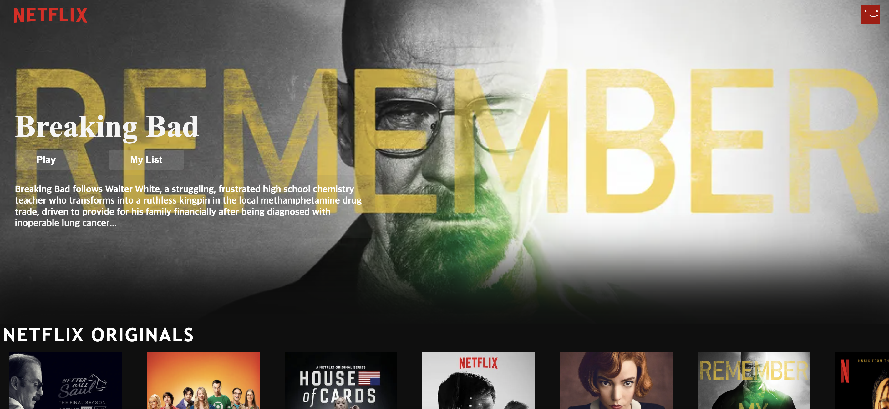

# 구름톤 트레이닝 커리큘럼 ( 9oormthon_Traning-Curriculum )
구름톤 트레이닝 일반 강의 및 실습 과제 모음

## 디렉토리 소개

### html_css
* HTML/CSS 기초 및 활용

### neflix_cloneCoding
* 실습과제 HTML, CSS를 이용한 넷플릭스 클론 코딩

### js_source_code
* Javascript 기초/문법

### TodoList 
* 실습과제 Js를 이용하여 Todo 앱 만들기
* 다크모드 추가 구현!!

 | 

### react_AtoZ 
* 리액트 A부터Z강의 소스코드